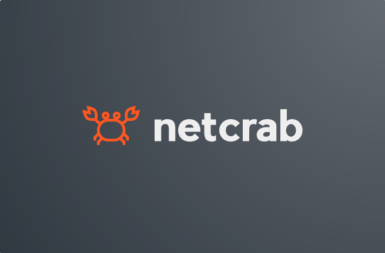

<a name="readme-top"></a>

<!-- PROJECT SHIELDS -->
<!--
*** I'm using markdown "reference style" links for readability.
*** Reference links are enclosed in brackets [ ] instead of parentheses ( ).
*** See the bottom of this document for the declaration of the reference variables
*** for contributors-url, forks-url, etc. This is an optional, concise syntax you may use.
*** https://www.markdownguide.org/basic-syntax/#reference-style-links
-->
[![Contributors][contributors-shield]][contributors-url]
[![Forks][forks-shield]][forks-url]
[![Stargazers][stars-shield]][stars-url]
[![Issues][issues-shield]][issues-url]
[![MIT License][license-shield]][license-url]

<!-- PROJECT LOGO -->
<br />
<div align="center">
  <a href="https://github.com/hlisdero/netcrab">
    
  </a>
  
<h3 align="center">netcrab</h3>

  <p align="center">
    A tool suite for creating, visualizing and analyzing Petri nets made in Rust
    <br />
    <a href="https://github.com/hlisdero/netcrab"><strong>Explore the docs »</strong></a>
    <br />
    <br />
    <a href="https://github.com/hlisdero/netcrab">View Demo</a>
    ·
    <a href="https://github.com/hlisdero/netcrab/issues">Report Bug</a>
    ·
    <a href="https://github.com/hlisdero/netcrab/issues">Request Feature</a>
  </p>
</div>

<!-- TABLE OF CONTENTS -->
<details>
  <summary>Table of Contents</summary>
  <ol>
    <li>
      <a href="#about-the-project">About The Project</a>
      <ul>
        <li><a href="#built-with">Built With</a></li>
      </ul>
    </li>
    <li>
      <a href="#getting-started">Getting Started</a>
      <ul>
        <li><a href="#prerequisites">Prerequisites</a></li>
        <li><a href="#installation">Installation</a></li>
      </ul>
    </li>
    <li><a href="#usage">Usage</a></li>
    <li><a href="#roadmap">Roadmap</a></li>
    <li><a href="#contributing">Contributing</a></li>
    <li><a href="#license">License</a></li>
    <li><a href="#contact">Contact</a></li>
    <li><a href="#acknowledgments">Acknowledgments</a></li>
  </ol>
</details>

<!-- ABOUT THE PROJECT -->
## About The Project

### Petri net implementation

The main implementation is found in `net.rs`. It uses two `BTreeMap` to store the places and transitions. References to places and transitions are named `PlaceRef` and `TransitionRef` respectively. These types are a wrapper around `String`. Places and transitions are labelled with `String`. These must be unique in the net.

References to the places and transitions are returned when adding them to the net. These references can later be used to add arcs and to access the markings.

_Note: References can be cloned. One may have as many references to a node or transition as desired._

### Supported export formats

- Petri Net Markup Language (PNML) [https://www.pnml.org/](https://www.pnml.org/)
- LoLA - A Low Level Petri Net Analyzer [https://theo.informatik.uni-rostock.de/theo-forschung/tools/lola/](https://theo.informatik.uni-rostock.de/theo-forschung/tools/lola/)
- DOT (graph description language) [https://en.wikipedia.org/wiki/DOT\_(graph_description_language)](<https://en.wikipedia.org/wiki/DOT_(graph_description_language)>)

<p align="right">(<a href="#readme-top">back to top</a>)</p>

### Built With

- [Rust](https://www.rust-lang.org/) > 1.65
- [cargo](https://doc.rust-lang.org/cargo/)
- [xml-rs](https://docs.rs/xml-rs/latest/xml/)

<p align="right">(<a href="#readme-top">back to top</a>)</p>

<!-- GETTING STARTED -->
## Getting Started

To get a local copy up and running follow these simple example steps.

### Prerequisites

- Install Rust using one of the methods described on the [Rust Website](https://www.rust-lang.org/tools/install)

### Installation

1. Clone the repo

   ```sh
   git clone https://github.com/hlisdero/netcrab.git
   ```

2. Build the project with `cargo`

   ```sh
   cargo build
   ```

3. Run the tests to check that everything works with `cargo`

   ```sh
   cargo test
   ```

<p align="right">(<a href="#readme-top">back to top</a>)</p>

<!-- USAGE EXAMPLES -->
## Usage

Creating a custom Petri net with a single place and a single transition forming a loop:

```rust
use netcrab::net::PetriNet;

let mut net = PetriNet::new();
let place_ref = net.add_place(&"Example place".to_string());
let transition_ref = net.add_transition(&"Example transition".to_string());

let result = net.add_arc_place_transition(&place_ref, &transition_ref);
assert!(result.is_ok());
let result = net.add_arc_transition_place(&transition_ref, &place_ref);
assert!(result.is_ok());
```

_For more examples, please refer to the unit tests in each module_

<p align="right">(<a href="#readme-top">back to top</a>)</p>

<!-- CONTRIBUTING -->
## Contributing

Contributions are what make the open source community such an amazing place to learn, inspire, and create. Any contributions you make are **greatly appreciated**.

If you have a suggestion that would make this better, please fork the repo and create a pull request. You can also simply open an issue with the tag "enhancement".
Don't forget to give the project a star! Thanks again!

1. Fork the Project
2. Create your Feature Branch (`git checkout -b feature/AmazingFeature`)
3. Commit your Changes (`git commit -m 'Add some AmazingFeature'`)
4. Push to the Branch (`git push origin feature/AmazingFeature`)
5. Open a Pull Request

<p align="right">(<a href="#readme-top">back to top</a>)</p>

<!-- LICENSE -->
## License

Distributed under the MIT License. See `LICENSE` for more information.

<p align="right">(<a href="#readme-top">back to top</a>)</p>

<!-- CONTACT -->
## Contact

Project Link: [https://github.com/hlisdero/netcrab](https://github.com/hlisdero/netcrab)

<p align="right">(<a href="#readme-top">back to top</a>)</p>

<!-- ACKNOWLEDGMENTS -->
## Acknowledgments

Based on the original work by Tom Meyer found in <https://github.com/Skasselbard/PetriToStar>

This `README.md` is based on the awesome template provided by [Best-README-Template](https://github.com/othneildrew/Best-README-Template)

<p align="right">(<a href="#readme-top">back to top</a>)</p>

<!-- MARKDOWN LINKS & IMAGES -->
<!-- https://www.markdownguide.org/basic-syntax/#reference-style-links -->
[contributors-shield]: https://img.shields.io/github/contributors/hlisdero/netcrab.svg?style=for-the-badge
[contributors-url]: https://github.com/hlisdero/netcrab/graphs/contributors
[forks-shield]: https://img.shields.io/github/forks/hlisdero/netcrab.svg?style=for-the-badge
[forks-url]: https://github.com/hlisdero/netcrab/network/members
[stars-shield]: https://img.shields.io/github/stars/hlisdero/netcrab.svg?style=for-the-badge
[stars-url]: https://github.com/hlisdero/netcrab/stargazers
[issues-shield]: https://img.shields.io/github/issues/hlisdero/netcrab.svg?style=for-the-badge
[issues-url]: https://github.com/hlisdero/netcrab/issues
[license-shield]: https://img.shields.io/github/license/hlisdero/netcrab.svg?style=for-the-badge
[license-url]: https://github.com/hlisdero/netcrab/blob/master/LICENSE.txt
